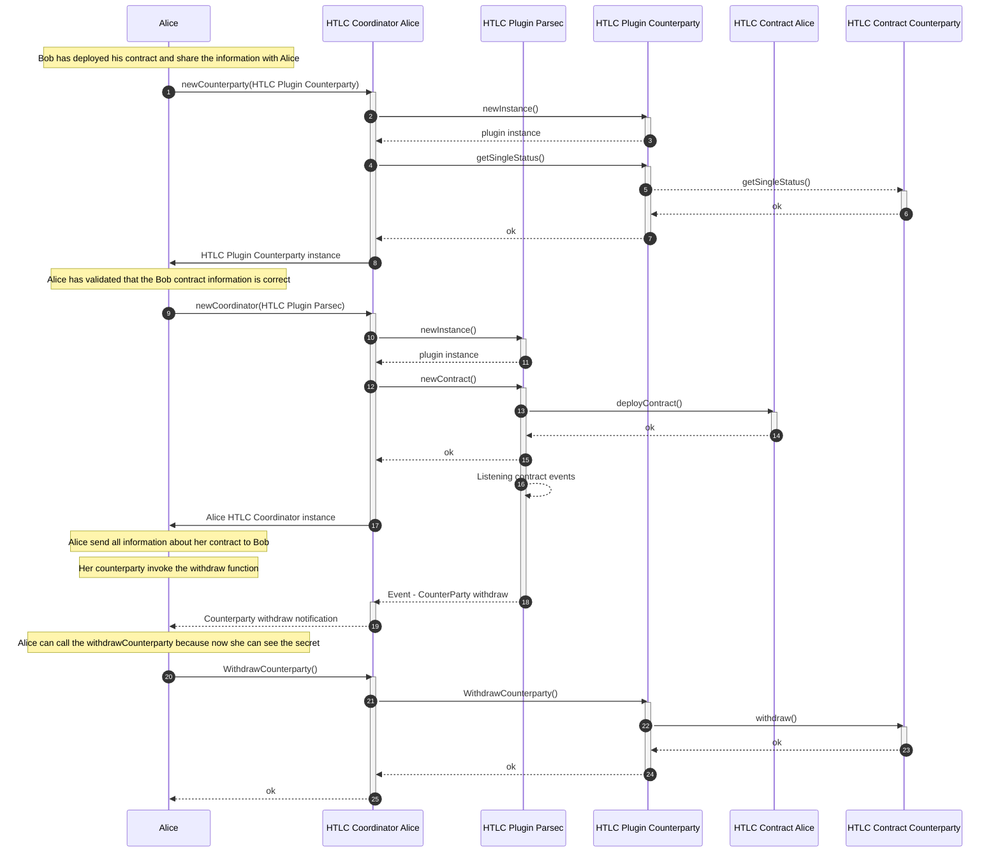

```mermaid
sequenceDiagram
autonumber
    participant Alice
    participant HTLC Coordinator Alice
    participant HTLC Plugin Parsec 
    participant HTLC Plugin Counterparty
    participant HTLC Contract Alice
    participant HTLC Contract Counterparty
    
   
    
    Note over Alice: Bob has deployed his contract and share the information with Alice
    Alice ->> HTLC Coordinator Alice: newCounterparty(HTLC Plugin Counterparty)
    activate HTLC Coordinator Alice
        HTLC Coordinator Alice ->> HTLC Plugin Counterparty: newInstance()
        activate HTLC Plugin Counterparty
            HTLC Plugin Counterparty-->> HTLC Coordinator Alice: plugin instance
        deactivate HTLC Plugin Counterparty
        HTLC Coordinator Alice  ->> HTLC Plugin Counterparty: getSingleStatus()
        activate HTLC Plugin Counterparty
            HTLC Plugin Counterparty -->> HTLC Contract Counterparty: getSingleStatus()
            activate HTLC Contract Counterparty
            HTLC Contract Counterparty -->> HTLC Plugin Counterparty: ok
            deactivate HTLC Contract Counterparty
            HTLC Plugin Counterparty -->>  HTLC Coordinator Alice: ok
        deactivate HTLC Plugin Counterparty
        HTLC Coordinator Alice ->> Alice: HTLC Plugin Counterparty instance
    deactivate HTLC Coordinator Alice
     Note over Alice: Alice has validated that the Bob contract information is correct
    Alice ->> HTLC Coordinator Alice: newCoordinator(HTLC Plugin Parsec)
    activate HTLC Coordinator Alice
        HTLC Coordinator Alice ->> HTLC Plugin Parsec: newInstance()
        activate HTLC Plugin Parsec
            HTLC Plugin Parsec -->> HTLC Coordinator Alice: plugin instance
        deactivate HTLC Plugin Parsec
        HTLC Coordinator Alice ->> HTLC Plugin Parsec: newContract()
            activate  HTLC Plugin Parsec
                HTLC Plugin Parsec ->> HTLC Contract Alice: deployContract()
                activate HTLC Contract Alice
                    HTLC Contract Alice -->> HTLC Plugin Parsec: ok
                deactivate HTLC Contract Alice
                HTLC Plugin Parsec -->>  HTLC Coordinator Alice: ok
                HTLC Plugin Parsec -->>  HTLC Plugin Parsec: Listening contract events
           
        HTLC Coordinator Alice ->> Alice: Alice HTLC Coordinator instance
    deactivate HTLC Coordinator Alice
    Note over Alice: Alice send all information about her contract to Bob
    Note over Alice: Her counterparty invoke the withdraw function
    HTLC Plugin Parsec -->> HTLC Coordinator Alice: Event - CounterParty withdraw
    deactivate HTLC Plugin Parsec
    activate HTLC Coordinator Alice
        HTLC Coordinator Alice -->> Alice: Counterparty withdraw notification
    deactivate HTLC Coordinator Alice
    Note over Alice: Alice can call the withdrawCounterparty because now she can see the secret
    Alice ->> HTLC Coordinator Alice: WithdrawCounterparty()
    activate HTLC Coordinator Alice
        HTLC Coordinator Alice ->> HTLC Plugin Counterparty: WithdrawCounterparty()
        activate HTLC Plugin Counterparty
        HTLC Plugin Counterparty ->> HTLC Contract Counterparty: withdraw()
            activate HTLC Contract Counterparty
                HTLC Contract Counterparty -->> HTLC Plugin Counterparty: ok
            deactivate HTLC Contract Counterparty
            HTLC Plugin Counterparty -->>  HTLC Coordinator Alice: ok
        deactivate HTLC Plugin Counterparty
    HTLC Coordinator Alice -->> Alice: ok
    deactivate HTLC Coordinator Alice
    
```